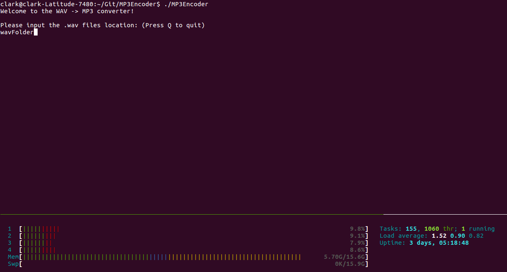
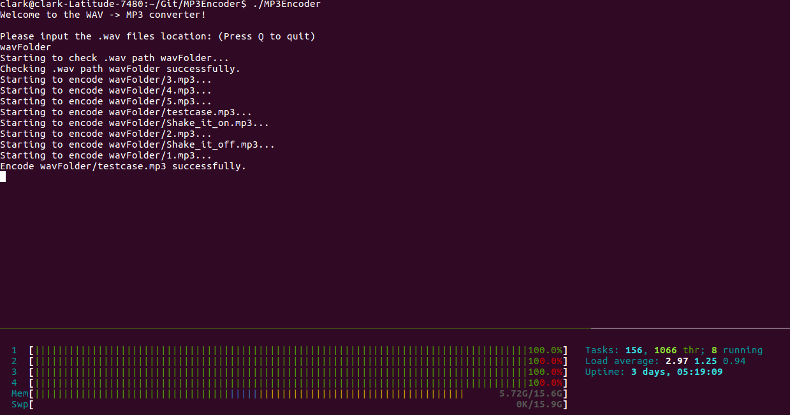
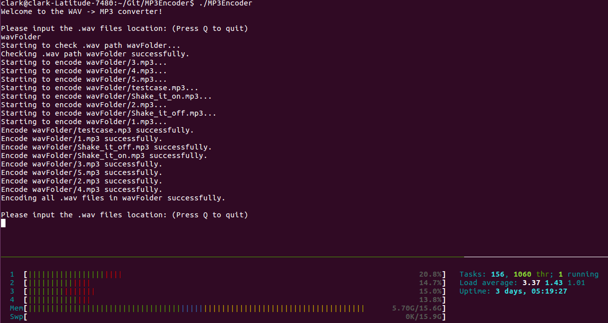

# MP3Encoder

MP3Encoder is a C++ application that converts WAV file(s) into MP3 file(s), with maintaining a good audio quality in 90% file-size reduction. This application is designed based on [LAME](http://lame.sourceforge.net/) and [POSIX thread](https://www.cs.cmu.edu/afs/cs/academic/class/15492-f07/www/pthreads.html), with cross-platform compatible in Windows / Linux / MacOS.

# Instruction

```bash
# Download the MP3Encoder repo
git clone git@github.com:ckyang/MP3Encoder.git

# Build the binary executable
make

# Execute the MP3Encoder
./MP3Encoder
```

# Overview

When executing `MP3Encoder`, you should input the folder name with `.wav` files inside.



After inputing a wav folder name, `MP3Encoder` will create multiple threads for encoding each `.mp3` files simutanously.



After every encoding jobs completed, you can try to encode another batch of `.wav` files, without terminating `MP3Encoder`.


